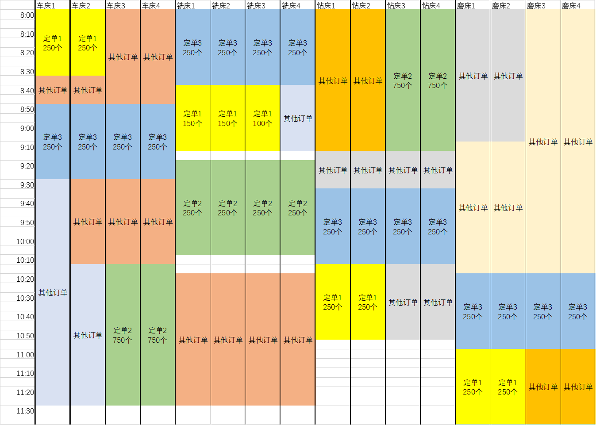

# Tanpopo APS 蒲公英生产排程系统

## 简介

本项目计划使用.Net实现一个工厂生产排程管理系统，提供完全部属在Windows上的生产计划排成功能。

## 软件结构

计划通过C/S个B/S两个部分实现，以适用于更多的场景。项目的结构初步计划有以下几个部分

1. 排程服务器（后端）
   1. 管理信息系统：存储工艺单、设备信息、人员信息等
   2. 排程管理系统：录入订单，生成排程计划
2. 前端系统
   1. 客户端软件（根据需要可能设计多种客户端）
   2. 网页服务器

## UI设计理念

1. 采用时间图的形式对排程信息进行显示。时间图示例如下图：

1. 2B的UI设计，力求清晰、高效

## 工厂假设

1. 有多种不同的订单形式
   1. 可能一次性收到大量订单
   2. 可能有长期订单（需要生产多个月或一年以上）
2. 有订单优先级
   1. 按截止时间
   2. 按优先级（不限截止时间）
3. 生产可能无法按照既定排程进行
   1. 生产设备可能出现问题（即机器需要暂停生产：转移）
   2. 生产人员可能出现问题（即人员需要暂停生产：换人）
   3. 订单材料可能出现问题（即订单需要暂停生产：换单）
4. 负责操作排程系统的工作人员会下班，而下班时仍然有工人在岗生产
   1. 在排程系统下班时，可能出现上述的三个问题
   2. 出现问题后，上班时排程系统录入上次下班时的生产问题，并重新排程
5. 有流转时间
   1. 工件运输
   2. 机器维护
   3. 人员更换

## 排程算法基本原则

1. 目标
   1. 最大机器利用率（最小机器空闲时间）
2. 约束
   1. 顺序约束：同一个订单必须按步骤先后生产
   2. 机床约束：同一个机床同时只能加工一个订单的一个步骤
   3. DDL约束：订单必须在截止期限内完成
   4. 启动约束：机床启动（无故障、有人工）时才能生产
   5. 作业约束：一个订单的一个步骤只能进行一次
   6. 流转约束？

## 参考的流程图

### 生产排程生成流程

### 部分操作流程

